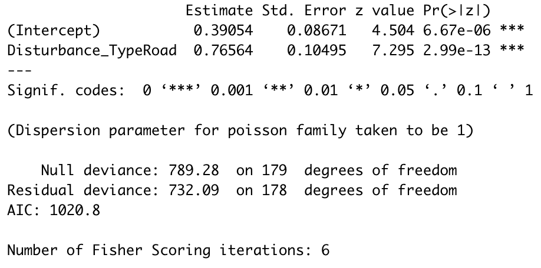

# Zero inflated models

------------------------------------------------------------------------

As an ecologist, selecting the best model to fit the data set you have gathered can be a tricky task, given the diverse selection of options. Most of the time, brainstorming and constructing your statistical model will involve trial and error, especially as the data sets become more detailed and complex. Hopefully, this tutorial will build on your knowledge of general linear models and mixed effect models.

The following tutorial is an introduction to zero-inflated models but it does require a prior understanding of data distribution, statistical models and data visualization. If you are a beginner on constructing statistical models for ecological data, these two Coding Club tutorials can build a solid foundation of understanding before proceeding:

-   Intro to model design available [here](https://ourcodingclub.github.io/tutorials/model-design/)
-   Intro to mixed effects models available [here](https://ourcodingclub.github.io/tutorials/mixed-models/)

This tutorial should teach you how to construct, assess, and present a zero-inflated model.

All the files required to complete this tutorial can be found from [this repository](https://github.com/EdDataScienceEES/tutorial-zacharyli1.git). Click on `Code/Download ZIP` and unzip the folder, or clone the repository to your own GitHub account.

------------------------------------------------------------------------

# Tutorial Structure:

1.  [Introduction to Zero-inflated Models] (#part1)
2.  [Model Trial and Error] (#part2)

-   Data distribution
-   Poisson model

3.  [Negative Binomal Response]

------------------------------------------------------------------------

# Introduction to Zero-inflated Models

{: #part1}

Many data sets in ecology can have a large proportion of zero values, especially when quantifying count data such as abundance or binary presence/absence data. There are two types of zeros in statistics, known as a 'true zero' or a 'false zero.' These are defined as:

-   True zero: A true zero is observed in the data if the zero observations are caused by an ecological effect, such as the explanatory variable.
-   False zero: A false zero is observed in the data if the zero observations are cause by observer or sampling errors in the data collection process.

Data sets are deemed 'zero inflated' when the number of zero values is so large that standard distributions (e.g., poisson, normal) do not accurately represent the data (Figure 1). Moreover, transforming the data (e.g., log, exponential) is insufficient to rectify the data in a way that would justify the use of a standard distribution. If you were to proceed to characterize the data using a standard distribution, there will be inherent bias introduced to your model. Hence, a different approach is needed to model the data.


------------------------------------------------------------------------

# Model Trial and Error

Let us begin our journey by exploring a data set containing information about an invasive species in Scotland, bracken!

Start by opening R Studio and set the working directory to the downloaded folder. Next, load the first package used for the initial visualization of our data This is done by:

``` r
 # Set working directory 
  setwd("your_filepath")
 # Load initial packages
 library(ggplot2)
```

Now we can load the data. Today, we will be exploring how the distribution of bracken (*Pteridium aquilinum*) is affected by disturbance from a study carried out by University of Edinburgh undergraduate students in Oban, Scotland. The objective of the data collection was to quantitatively represent whether bracken distribution differed between roads and footpaths.

Roads are a unique type of disturbance because they act as vectors for the transport of non-native invasive species into neighboring plant communities. Bracken is a fast-growing weed that exists in many ecosystems in the Scottish Highlands and threatens the biodiversity of native plant communities. The aim of this study is to understand how bracken is distributed along roads and footpaths in Oban, Scotland to determine its implications on the native flora.

``` r
 # Load the data
 invasive <- read.csv(file = 'data/invasive.csv')
```

Let us do a basic visualization of our data set.

``` r
# Visualize the data set
head(invasive)
str(invasive)
```

Before we begin constructing a model to characterize the data set, we need to brainstorm a research question to answer. For this tutorial, we will focus on this research question: **Is there a difference in the number of bracken stands between roads and footpaths?**

In an ecological context, we will be investigating the effect of the explanatory variable or fixed effect road type (e.g., roads and footpaths) on the response variable, the number of bracken stands. We can visualize our explanatory variable and response variable.

``` r
# Show the explanatory variable
unique(invasive$Disturbance_Type) 

# Show the response variable
unique(invasive$Bracken_stands)
```

Later, we will incorporate these factors into our model to determine whether road type has an effect on bracken abundance.

------------------------------------------------------------------------

## Data distribution

{: #distrib}

We have now established our research question as well as the variables we intend to incorporate in our study. Next, we will build on this knowledge by visualizing the data set as a histogram. This helps us gauge a better understanding of the type of distribution our data follows as well as assissting us in the model selection process.

``` r
# Create a histogram of initial distribution
(hist_invasive <- ggplot(invasive, aes(x = Bracken_stands)) +
    geom_histogram(colour = "black", fill = "#006633", bins = 15) +
    theme_classic() +
    ylab("Frequency\n") +
    ggtitle("Histogram of Bracken Stand Distribution") +
    xlab("\nNumber of bracken stands") +  
    theme(plot.title = element_text(hjust = 0.5, vjust = -8, size = 13)) +
    theme(axis.text = element_text(size = 12),
          axis.title = element_text(size = 14, face = "plain")))
```

In the "Plots" tab in RStudio, you should see a histogram that looks like this: 

Now that we have generated our histogram, we can save it to use in a report later on to provide the reader insight into our data set.

``` r
# Save histogram
ggsave(filename = "figures/bracken_stand_histogram.png", hist_invasive, device = "png")
```

As we can see from the plot, the response variable (number of bracken stands) is in the form of count data. This means that all observations of bracken stand abundance is non-negative and is in the form of whole numbers. Moreover, we can see that our data has a right skew, meaning it has a tail extending to the right.

Evidently, we can also see that our data has quite the number of zero observations! We can calculate the proportion of our number of bracken stands observations that are zeros.

``` r
# Deduce proportion of zeros in the data 
sum(invasive$Bracken_stands == 0)/nrow(invasive) # ~49% of the observations are zeros!
```

Despite the large number of zero observations, the data appears to roughly follow a poisson distribution. We will use this information into our first model.

------------------------------------------------------------------------

## First model

We can begin our modelling process by fitting a basic poisson model to our bracken data.

``` r
 # Build a basic poisson model
poisson_model <- glm(Bracken_stands~Disturbance_Type, data = invasive, family = poisson)
```

In R, a poisson model has the same structure as a linear model, except another argument called 'family' is added. Poisson distributions are log-link functions, meaning that they cannot produce negative numbers.

We can extract the summary of the model by running this line of code.

``` r
 summary(poisson_model)
```

The summary output should look something like this.



From our poisson model, we can deduce that the road type has a significant effect on the number of bracken stands. So, does that the modelling process is done? No, not quite! There are several issues with this first model that we have constructed.

First, a poisson model assumes that the variance of the distribution is equal to the mean. This means that the statistical tests that R has run from your model was under the assumption that the dispersion ratio was ~1. If the dispersion ratio was ~1, the basic poisson model we have constructed would be appropriate and the results could be trusted. However, if the variance is greater than the mean, then there is what is called overdispersion. We can check this assumption with this line of code.

``` r
library(dplyr) # improve data manipulation efficiency

mean(invasive$Bracken_stands) %>% round(4) # round to 4 decimal places
var(invasive$Bracken_stands) %>% round (4) # round to 4 decimal places
var(invasive$Bracken_stands)/mean(invasive$Bracken_stands) # calculate ratio between variance and mean 
```

We can deduce that the mean and the variance are drastically different (ratio \> 1) and there is clear overdispersion of the data.

Similarly, overdispersion can be calculated by looking at the summary table generated from the model. This is done by dividing the residual deviance by the residual degrees of freedom. If this value is greater than 1, then the data has overdispersion. In this case, it would be:

``` r
732.09/178
```

Okay, so now we have deduced that we have a fair bit of overdispersion. What does this mean? Because the assumption of our poisson model was violated, the model we have constructed poorly fits the data and the results cannot be trusted. If the ratio obtained from the overdispersion test is greater than 2 (which it is in our case), we should probably consider other models that would more accurately represent the data that we have collected.

If we wanted to assess the fit of our model further, we can compare the basic poisson model we have constructed with a null model. We can do by constructing a null model by estimating intercepts only like so:

```r
mod_null <- glm(Bracken_stands~1, data = invasive, family = poisson)
```

The '1' included in the null model is R speak for only estimating the intercept. Now, we can compare the two models using the Akaike Information Criterion (AIC). In simple terms, AIC compares the fit of different models based on the probability or likelihood of the model. The lower the AIC value, the better the model fits the data. We can do this like so:

```r
AIC(mod_null, poisson_model)
```

By comparing AIC values, we can deduce that the poisson model we have constructed fits the data better than a null model, which is encouraging. However, the high dispersion ratio of the poisson model makes it difficult to trust the results. Next, we will explore the negative binomial response model, which does a much better job at fitting overdispersed data!

***

## Negative Binomial Response


