# Zero inflated models

------------------------------------------------------------------------

As an ecologist, selecting the best model to fit the data set you have gathered can be a tricky task, given the diverse selection of options. Most of the time, brainstorming and constructing your statistical model will involve trial and error, especially as the data sets become more detailed and complex. Hopefully, this tutorial will build on your knowledge of general linear models and mixed effect models.

The following tutorial is an introduction to zero-inflated models but it does require a prior understanding of data distribution, statistical models and data visualization. If you are a beginner on constructing statistical models for ecological data, these two Coding Club tutorials can build a solid foundation of understanding before proceeding:

-   Intro to model design available [here](https://ourcodingclub.github.io/tutorials/model-design/)
-   Intro to mixed effects models available [here](https://ourcodingclub.github.io/tutorials/mixed-models/)

This tutorial should teach you how to construct, assess, and present a zero-inflated model.

All the files required to complete this tutorial can be found from [this repository](https://github.com/EdDataScienceEES/tutorial-zacharyli1.git). Click on `Code/Download ZIP` and unzip the folder, or clone the repository to your own GitHub account.

------------------------------------------------------------------------

# Tutorial Structure:

1.  [Introduction to Zero-inflated Models] (#part1)
2.  [Model Trial and Error] (#part2)

-   Data distribution
-   Poisson model

3.  [Negative Binomial Response]

-   Model construction
-   Interpreting model results

4.  [Zero-inflation Evaluation]

-   Zero-inflation test

5.  [Zero-inflated Models](#zero-inflated-models-1)

-   Interpreting summary table
-   Adding random effects
-   Analyzing results

6.  [Conclusion]

-   Further implications

------------------------------------------------------------------------

# Introduction to Zero-inflated Models

{: #part1}

Many data sets in ecology can have a large proportion of zero values, especially when quantifying count data such as abundance or binary presence/absence data. There are two types of zeros in statistics, known as a 'true zero' or a 'false zero.' These are defined as:

-   True zero: A true zero is observed in the data if the zero observations are caused by an ecological effect, such as the explanatory variable.
-   False zero: A false zero is observed in the data if the zero observations are cause by observer or sampling errors in the data collection process.

Data sets are deemed 'zero inflated' when the number of zero values is so large that standard distributions (e.g., poisson, normal) do not accurately represent the data (Figure 1). Moreover, transforming the data (e.g., log, exponential) is insufficient to rectify the data in a way that would justify the use of a standard distribution. If you were to proceed to characterize the data using a standard distribution, there will be inherent bias introduced to your model. Hence, a different approach is needed to model the data.


------------------------------------------------------------------------

# Model Trial and Error

Let us begin our journey by exploring a data set containing information about an invasive species in Scotland, bracken!


Start by opening R Studio and set the working directory to the downloaded folder. Next, load the first package used for the initial visualization of our data This is done by:

``` r
 # Set working directory 
  setwd("your_filepath")
 # Load initial packages
 library(ggplot2)
```

Now we can load the data. Today, we will be exploring how the distribution of bracken (*Pteridium aquilinum*) is affected by disturbance from a study carried out by University of Edinburgh undergraduate students in Oban, Scotland. The objective of the data collection was to quantitatively represent whether bracken distribution differed between roads and footpaths.

Roads are a unique type of disturbance because they act as vectors for the transport of non-native invasive species into neighboring plant communities. Bracken is a fast-growing weed that exists in many ecosystems in the Scottish Highlands and threatens the biodiversity of native plant communities. The aim of this study is to understand how bracken is distributed along roads and footpaths in Oban, Scotland to determine its implications on the native flora.

``` r
 # Load the data
 invasive <- read.csv(file = 'data/invasive.csv')
```

Let us do a basic visualization of our data set.

``` r
# Visualize the data set
head(invasive)
str(invasive)
```

Before we begin constructing a model to characterize the data set, we need to brainstorm a research question to answer. For this tutorial, we will focus on this research question: **Is there a difference in the number of bracken stands between roads and footpaths?**

In an ecological context, we will be investigating the effect of the explanatory variable or fixed effect road type (e.g., roads and footpaths) on the response variable, the number of bracken stands. We can visualize our explanatory variable and response variable.

``` r
# Show the explanatory variable
unique(invasive$Disturbance_Type) 

# Show the response variable
unique(invasive$Bracken_stands)
```

Later, we will incorporate these factors into our model to determine whether road type has an effect on bracken abundance.

------------------------------------------------------------------------

## Data distribution

{: #distrib}

We have now established our research question as well as the variables we intend to incorporate in our study. Next, we will build on this knowledge by visualizing the data set as a histogram. This helps us gauge a better understanding of the type of distribution our data follows as well as assisting us in the model selection process.

``` r
# Create a histogram of initial distribution
(hist_invasive <- ggplot(invasive, aes(x = Bracken_stands)) +
    geom_histogram(colour = "black", fill = "#006633", bins = 15) +
    theme_classic() +
    ylab("Frequency\n") +
    ggtitle("Histogram of Bracken Stand Distribution") +
    xlab("\nNumber of bracken stands") +  
    theme(plot.title = element_text(hjust = 0.5, vjust = -8, size = 13)) +
    theme(axis.text = element_text(size = 12),
          axis.title = element_text(size = 14, face = "plain")))
```

In the "Plots" tab in RStudio, you should see a histogram that looks like this: 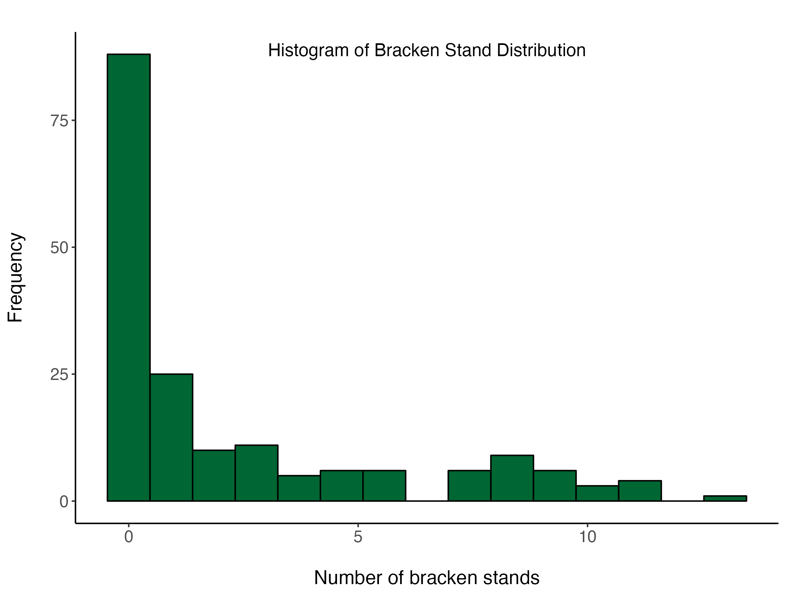

Now that we have generated our histogram, we can save it to use in a report later on to provide the reader insight into our data set.

``` r
# Save histogram
ggsave(filename = "figures/bracken_stand_histogram.png", hist_invasive, device = "png")
```

As we can see from the plot, the response variable (number of bracken stands) is in the form of count data. This means that all observations of bracken stand abundance is non-negative and is in the form of whole numbers. Moreover, we can see that our data has a right skew, meaning it has a tail extending to the right.

Evidently, we can also see that our data has quite the number of zero observations! We can calculate the proportion of our number of bracken stands observations that are zeros.

``` r
# Deduce proportion of zeros in the data 
sum(invasive$Bracken_stands == 0)/nrow(invasive) # ~49% of the observations are zeros!
```

Despite the large number of zero observations, the data appears to roughly follow a poisson distribution. We will use this information into our first model.

We can also visualize how the number of bracken stands is distributed according to our explanatory variable, road type using a boxplot.

``` r
# Create boxplot of bracken stand distribution according to road type
(bracken_boxplot <- ggplot(invasive, aes(Disturbance_Type, Bracken_stands)) + 
    geom_boxplot(aes(fill = Disturbance_Type)) +
    theme_bw() +
    scale_fill_manual(values = c("#EE7600", "#00868B")) + # Adding custom colours
    scale_colour_manual(values = c("#EE7600", "#00868B")) + # Adding custom colours
    ylab("Number of Bracken Stands\n") +                             
    xlab("\nRoad Type")  +
    theme(axis.text = element_text(size = 12),
          axis.title = element_text(size = 14, face = "plain"),                     
          panel.grid = element_blank(), # Removing the background grid lines               
          plot.margin = unit(c(1,1,1,1), units = , "cm"), # Adding a margin
          legend.position = "none")) # Removing legend - not needed with only 2 factors

# Save boxplot
ggsave(filename = "figures/bracken_stand_boxplot.png", bracken_boxplot, device = "png")
```

The box plot generated should look something like this: 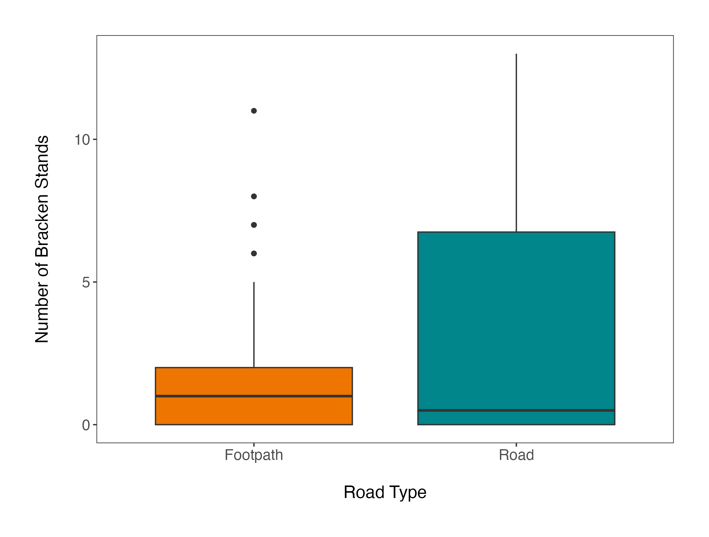

From this initial box plot, we can see that the data distributions within groups does not appear to be normal or exhibit identical variances. This is quite a common feature in ecological data! This will have implications as we build on model complexity, but for now it is good to keep this in mind.

Now that we have a good idea of how our data is distributed as well as our variables of interest, we can proceed to build our first model!

------------------------------------------------------------------------

## First model

When we begin to model data distributions with count data, it is common to start with a poisson regression. We can begin our modelling process by fitting a basic poisson model to our bracken data.

``` r
 # Build a basic poisson model
poisson_model <- glm(Bracken_stands~Disturbance_Type, data = invasive, family = poisson)
```

In R, a poisson model has the same structure as a linear model, except another argument called 'family' is added. Poisson distributions are log-link functions, meaning that they cannot produce negative numbers.

We can extract the summary of the model by running this line of code.

``` r
 summary(poisson_model)
```

The summary output should look something like this.


From our poisson model, we can deduce that the road type has a significant effect on the number of bracken stands. So, does that the modelling process is done? No, not quite! There are several issues with this first model that we have constructed.

First, a poisson model assumes that the variance of the distribution is equal to the mean. This means that the statistical tests that R has run from your model was under the assumption that the dispersion ratio was \~1. If the dispersion ratio was \~1, the basic poisson model we have constructed would be appropriate and the results could be trusted. However, if the variance is greater than the mean, then there is what is called overdispersion. We can check this assumption with this line of code.

``` r
library(dplyr) # improve data manipulation efficiency

mean(invasive$Bracken_stands) %>% round(4) # round to 4 decimal places
var(invasive$Bracken_stands) %>% round (4) # round to 4 decimal places
var(invasive$Bracken_stands)/mean(invasive$Bracken_stands) # calculate ratio between variance and mean 
```

We can deduce that the mean and the variance are drastically different (ratio \> 1) and there is clear overdispersion of the data.

Similarly, overdispersion can be calculated by looking at the summary table generated from the model. This is done by dividing the residual deviance by the residual degrees of freedom. If this value is greater than 1, then the data has overdispersion. In this case, it would be:

``` r
732.09/178
```

Okay, so now we have deduced that we have a fair bit of overdispersion. What does this mean? Because the assumption of our poisson model was violated, the model we have constructed poorly fits the data and the results cannot be trusted. If the ratio obtained from the overdispersion test is greater than 2 (which it is in our case), we should probably consider other models that would more accurately represent the data that we have collected.

If we wanted to assess the fit of our model further, we can compare the basic poisson model we have constructed with a null model. We can do by constructing a null model by estimating intercepts only like so:

``` r
mod_null <- glm(Bracken_stands~1, data = invasive, family = poisson)
```

The '1' included in the null model is R speak for only estimating the intercept. Now, we can compare the two models using the Akaike Information Criterion (AIC). In simple terms, AIC compares the fit of different models based on the probability or likelihood of the model. The lower the AIC value, the better the model fits the data. We can do this like so:

``` r
AIC(mod_null, poisson_model)
```

Here is the output of the model comparison:

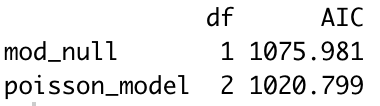

By comparing AIC values, we can deduce that the poisson model we have constructed fits the data better than a null model, which is encouraging. However, the high dispersion ratio of the poisson model makes it difficult to trust the results. Next, we will explore the negative binomial response model, which does a much better job at fitting overdispersed data!

------------------------------------------------------------------------

## Negative Binomial Response

One way to address our issue of overdispersed data is to use a Negative Binomial Regression. The negative binomial regression also describes non-negative count data similar to the Poisson distribution, except it does not hold the assumption that the mean and the variance are the same. In fact, it assumes that the variance increases quadratically relative to the mean, which means that the count data is more dispersed

A negative binomial model has been cited on many instances in the literature for modelling data with a considerable number of zeros because it accounts for overdispersion. However, if the number of zeros exceeds the amount expected from a negative binomial distribution, we may have to take another approach.

------------------------------------------------------------------------

## Model construction

Let us build our negative binomial model using the package "MASS." For more information regarding the this package and the negative binomial regression, you can check out [this website](https://stats.oarc.ucla.edu/r/dae/negative-binomial-regression/). First, we have to load the specified library.

``` r
library(MASS)
```

For this tutorial, we will use the **glm.nb** function from MASS to fit our negative binomial model. It follows nearly the identical structure to the **glm** function, except the 'family' term does not need to be specified.

``` r
summary(negbinom_model <- glm.nb(Bracken_stands~Disturbance_Type, data = invasive))
```

Here is what the summary table should look like: 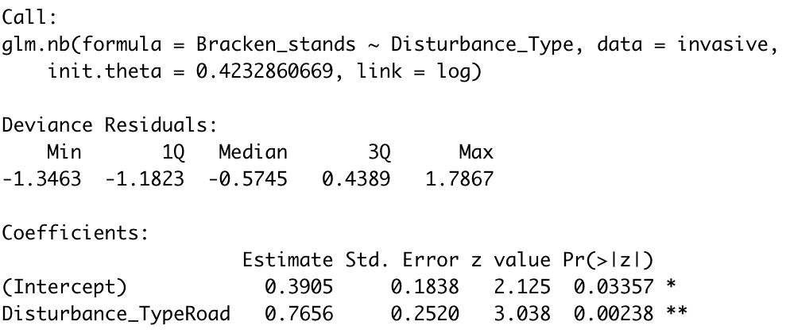

The format of the summary goes as follows. Below the call and deviance residuals are the estimated regression coefficients for each variable in the model along with the standard error, z-scores, and p-value.

------------------------------------------------------------------------

## Interpreting model results

According to our model, the variable road type has a statistically significant effect on the number of bracken stands (p \< 0.01). The variable has a coefficient of 0.7656, meaning that the expected log count of bracken stands is 0.7656 higher in footpaths due to the effect of road type.

The **glm.nb** function characterizes the data based on the negative binomial error distribution and also includes an extra term theta, which is the overdispersion parameter. The larger the value of the overdispersion parameter is, the less variance there is and hence a poisson model may represent the data more effectively.

So far, we have recognized that our data was overdispersed, and selected a model to rectify some of the shortcomings of our previous Poisson model. In fact, let us compare the model fit of our two models using AIC.

``` r
AIC(poisson_model, negbinom_model)
```

Here are the results of our model comparison:

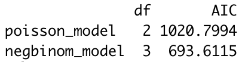

As we can see, the negative binomial model we have constructed fits the data far better than the Poisson model initially constructed.

To review, we elected to model our bracken data with a negative binomial response because it effectively characterizes overdispersed count variables. However, it is also important to consider the underlying cause of data overdispersion. In our case, the large number of zeros in the data set could be causing overdispersion due to another underlying process. Therefore, we should consider using a zero-inflated model to represent our data and compare the model fit afterwards.

------------------------------------------------------------------------

## Zero-inflation evaluation

Zero-inflation is a unique case of overdispersion, where there are more zeros in the data set than expected in a fitted model. From our initial analysis, we determined that 49% of the observations for number of bracken stands were zeros. It is important to remember that just because a data set contains a lot of zeros does not mean it is necessarily zero-inflated!

Today, we will use the DHARMa package developed by Florian Hartig to test for zero-inflation of the data. More information about DHARMa is available on [this website](https://cran.r-project.org/web/packages/DHARMa/vignettes/DHARMa.html#zero-inflation-k-inflation-or-deficits).

In order to build more complex generalized mixed linear models (e.g., zero-inflated models), we will need to install the glmmTMB R package. In essence, it allows the user to produce a much broader range of statistical distributions. More information regarding the glmmTMB package is available on [this website](https://glmmtmb.github.io/glmmTMB/).

Let us begin by installing the necessary libraries.

``` r
library(glmmTMB) # generate zero-inflated mixed models
library(DHARMa) # allows for zero-inflation testing
```

We can proceed by building our test model using the glmm.TMB() function. Then, we will first begin by visualize the plot residuals.

``` r
mod1 <- glmmTMB(Bracken_stands~Disturbance_Type, family = "poisson", data = invasive) # build model
simulationOutput <- simulateResiduals(fittedModel = mod1) # generate residuals
plot(simulationOutput) # visualize residuals
```

Here is what the output should look something like.

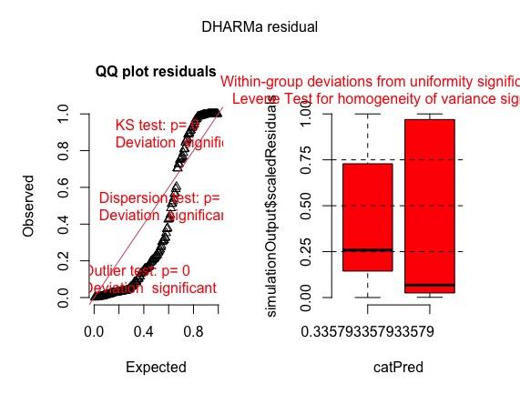

For this tutorial, we will focus on the Q-Q plot residuals on the left hand side of the panel. Furthermore, we can make the plot less messy and easier to interpret using the plotQQunif() function.

``` r
plotQQunif(simulationOutput = simulationOutput, 
           testDispersion = FALSE,
           testUniformity = FALSE,
           testOutliers = FALSE)
```

Similar to a linear regression, the Q-Q plot residuals graph shows an overall distribution of the residuals, where a "correct" residual distribution is one that roughly follows the 1-1 straight red line. In our particular study, we can see that the residuals are not surprisingly not correctly distributed. Now, we can move to the actual zero-inflation test.

------------------------------------------------------------------------

## Zero-inflation Test

The benefit of using the DHARMa package is that it has its own test for zero-inflation of the data. In essence, the distribution of the expected zeros will be compared with the observed zeros in our bracken data set. Let us run the zero-inflation test and discuss the implications of its results.

``` r
testZeroInflation(simulationOutput)
```

A graph that looks something like this should appear in the plots panel. This displays the expected distribution of zeros in comparison to the distribution of zeros in the bracken data set.

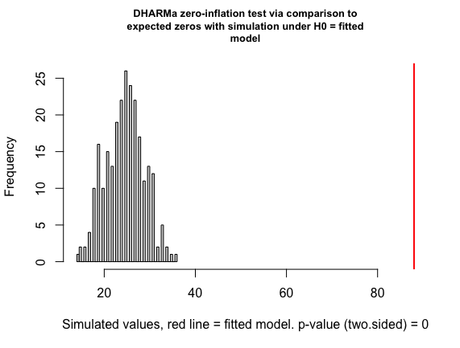

Next, we are given the summary outputs in the R console.

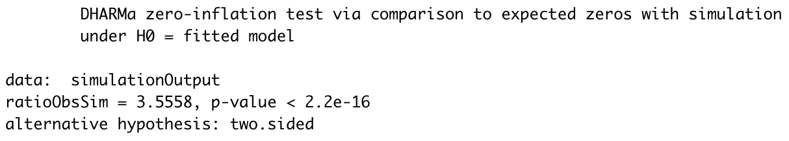

The first output of importance is the ratioObsSim, which shows the observed versus the simulated zeros. A value of \<1 indicates less zeros than expected and a value \>1 indicates zero-inflation of the data. In our case the ratioObsSim from the zero-inflation test was 3.6, meaning there were a lot more zeros in our bracken data than expected.

Next, the p-value indicates whether the zeros in our data are signficant (zero-inflation present). In our case, the zero-inflation test reveals that there is zero-inflation in the bracken data (p \< 0.01).

With the zero-inflation test completed, we have established our rationale for the use of a zero-inflated model. Now, we can build our zero-inflated model and compare it to the previous models we have constructed!

------------------------------------------------------------------------

## Zero-inflated Models {#zero-inflated-models-1}

Before we construct our zero-inflated model, we should consider what the excess number of zeros means in the ecological context of our study. The sampling zeros in the data set can be modelled with a Poisson or negative binomial response, which is a result that could have occurred due to chance. More specifically, the sampling zeros in our data set are attributed to the fluctuations in the number of bracken stands in different road types.

A structural zero is one that occurs due to the characteristic of the site. In our study, certain quadrats sampled may simply be situated in an environment that does not allow for the proliferation of bracken. As a result, the structural zeros in the data set are a product of the site characteristics (not road type) that will always result in the recorded observation being zero. In essence, a zero-inflated model accounts for the differences in the generation pattern of zeros that a standard distribution could not.

We will build our zero-inflated model by using the glmmTMB R package. The notation differs from a glm or lme4 syntax, as it contains more parameters that need to be specified. Here is the model we will use for our study:

``` r
# Build zero-inflated model using glmmTMB()
zero_inflated_nbiom <- glmmTMB(Bracken_stands ~ Disturbance_Type, ziformula = ~Disturbance_Type, family = "nbinom2", data = invasive)
```

The syntax of a zero-inflated model starts off identical to that of an lme4 by first stating the formula we want to test. In this case, we are assessing the effect of road type on the number of bracken stands. Next, the term "ziformula" (can also be written as just "zi") is the zero-inflation term. If there is no zero-inflation of the data, this term would be written as \~0. However, in our study, we are assuming that the absences (zeros) will vary based on road type, so we write it as ziformula = \~Disturbance_Type. Furthermore, we told the model to use a negative binomial model over a poisson model due to overdispersion of the data using family = "nbinom2." The family "nbiom2" specifes that the variance increases quadratically with the mean, rather than linearly ("nbinom1"). Finally, we specified the data set of interest using data = invasive.

Before we continue onto our summary and analysis, let us compare the fit of our new model with the ones previously constructed. We can do this once again by using AIC.

``` r
AIC(poisson_model, negbinom_model, zero_inflated_nbiom)
```

Here are the results of our comparison.

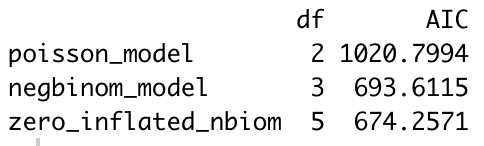

As we can see, the zero-inflated negative binomial model we have constructed fits the data much better than the poisson model and the negative binomial model! To further emphasize that we have chosen our model correctly, lets build a zero-inflated poisson model and see how it fairs against the zero-inflated negative binomial model we constructed. This can be done like so:

``` r
# Build zero-inflated poisson model
zero_inflated_poisson <- glmmTMB(Bracken_stands ~ Disturbance_Type, ziformula = ~Disturbance_Type, family = "poisson", data = invasive)

# Compare model fit using AIC
AIC(poisson_model, negbinom_model, zero_inflated_poisson, zero_inflated_nbiom)
```

Here are the results of the summary output:

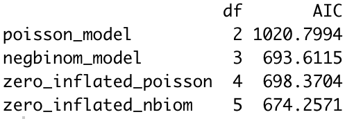

As we can see, the negative binomial model (no zero-inflation) characterized the data more effectively than the zero-inflated poisson model. This indicates that even despite accounting for the large number of zeros, the data set contains more variability than that predicted from a Poisson distribution. In essence, adding more complexity to our basic negative binomial model improved the estimations considerably. From our AIC test of model fit, we can be confident that we have constructed the best model to represent our bracken data.

------------------------------------------------------------------------

## Interpreting summary table

Now that we have gone through all the checks, we can see the results of our analysis! We can do this by using the code:

``` r
summary(zero_inflated_nbiom)
```

Here is what the summary table should look something like.

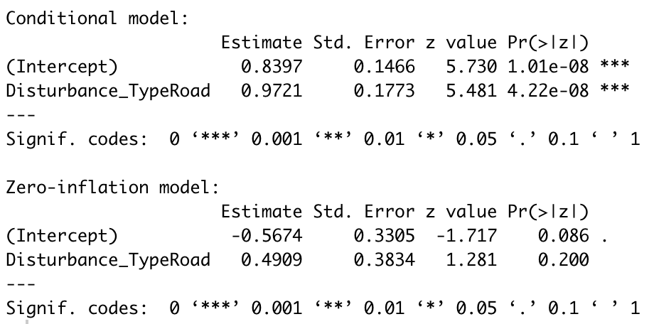

The conditional model represents the response in the absence of zero-inflation. In standard GLM or GLMM models, only the "conditional model" is fit to the data under the assumption that zero-inflation is set at the default value. The zero-inflation model represents the probability of generating a structural zero not accounted for by the conditional model.

WAIT! Before we continue, we have to look futher in depth in our data collection process to make sure our model accurately represents the distribution of bracken in Oban.

------------------------------------------------------------------------

## Adding random effects

In this study, observations were taken from two road types: (1) roads and (2) footpaths. Within each road, a total of 6 transects were laid out perpendicular to the road with an additional 5 quadrats placed within each transect. Here is a visual representation of the sampling strategy.

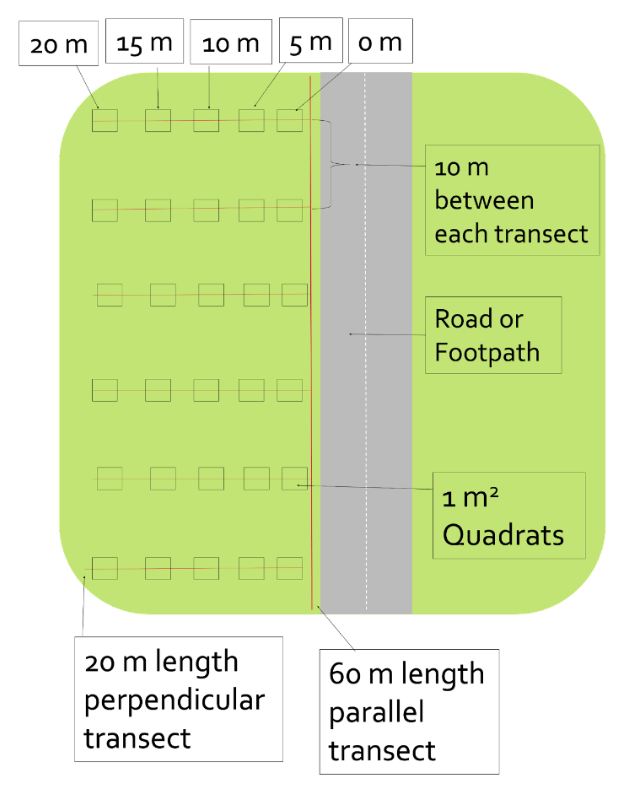

After visualizing the sampling scheme, we can see that not all of our observations are independent! What does this mean? This implies that bracken observations within the same road and same transect are more likely to be similar to each other. In essence, the measurement of one of our observations provides insight into another observation, meaning that our observations are not random. This is called pseudoreplication!

This is problematic because the current state of our model does not account for our sampling process. By including the road number and transect number as random effects, we are essentially telling the model that the levels existing in the data set are related. Moreover, we do not care about how the number of bracken stands are distributed between the same road type or how they vary between transects.

We can build this complexity into our model by adding the road number (Disturbance_Number) and transect number (Transect_Number) as random effects to the conditional formula of our model. Our new model will look something like this:

``` r
zero_inflated_nbiom2 <- glmmTMB(Bracken_stands ~ Disturbance_Type + (1|Disturbance_Number) + (1|Transect_Number), ziformula = ~Disturbance_Type, family = "nbinom2", data = invasive)
```

We can compare our new model (random effects included) with our previous model with only fixed effects using AIC.

``` r
AIC(zero_inflated_nbiom, zero_inflated_nbiom2)
```

Here are the results:

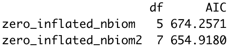

As we can see, including the two random effects improved the model fit of the data considerably. We can also test whether the inclusion the random effects are needed using a likelihood ratio test. The likelihood ratio test compares the two models with each other and determine whether including the random effects actually improve the model fit. This can be done like so:

``` r
anova(zero_inflated_nbiom, zero_inflated_nbiom2)
```

Here is what the summary table should look like:

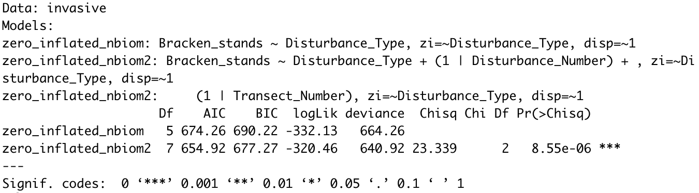

A handy component of the likelihood ratio test is that it also shows the AIC. The p-value represents the significance of the random effects of the model, given that the fixed effects were set as constant between the two models.

Now, what if we considered these two random effects as having an effect on the generation process of structural zeros? We can easily test this by including the two random effects on the "ziforumla" portion of the formula. Our new model will look like this:

``` r
zero_inflated_nbiom3 <- glmmTMB(Bracken_stands ~ Disturbance_Type + (1|Disturbance_Number) + (1|Transect_Number), ziformula = ~Disturbance_Type + (1|Disturbance_Number) + (1|Transect_Number), family = "nbinom2", data = invasive)
```

We can check the model fit of our new model once again by using AIC.

``` r
AIC(zero_inflated_nbiom, zero_inflated_nbiom2, zero_inflated_nbiom3)
```

Here are the results of the comparison:

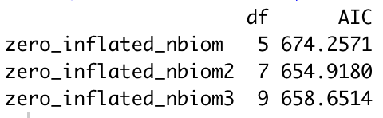

From this test, we can see that adding further complexity to the model actually worsened the model fit. Similarly, it can be implied that the random effects we included had little effect on the generation process of structural zeros. We deduced that the zero-inflated negative binomial model with random effects on the conditional side of the formula was the best fit.

Now that we have thoroughly considered the entire context of the study, we can confidently interpret our model results!

------------------------------------------------------------------------

## Analyzing results

Similar to the first zero-inflated model we constructed, we can use the summary() function to extrapolate our findings.

``` r
summary(zero_inflated_nbiom2)
```

Here is what the summary table should look like:

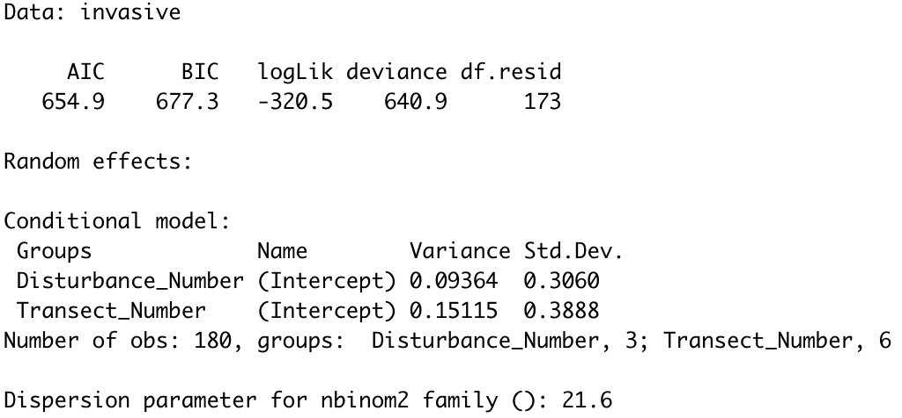 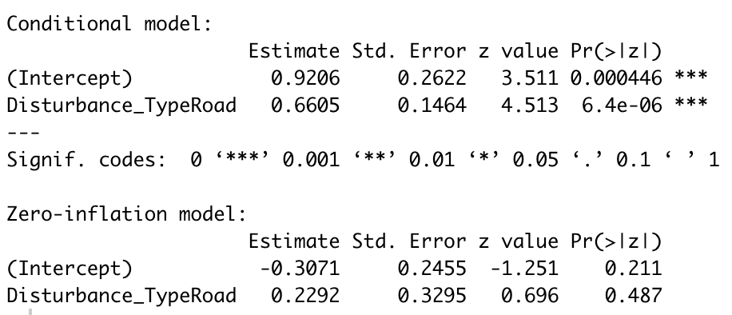

First, the random effects are shown. The variance and standard deviations are displayed, as well as the sample size and dispersion parameter.

Next, the conditional model is shown. The p-value is important to note, as it can be interpreted as the probability of the results given that the null hypothesis is true. In our case, we can deduce that the road type has a significant effect on the number of bracken stands. More importantly, the coefficient estimates provide us with further insight into the ecological implications of our findings.

We can estimate the effect size of road type by comparing the baseline (intercept) with the mean. In our case, the baseline number of bracken stands in both road types would be 0.9206 bracken stands. Because the data is log-transformed by using a negative binomial response, we have to undo it by getting the exponential value of the log-transformation. In this case, we estimate that the baseline number of bracken stands is 2.51. Now, we can undo the log-transformation of the mean and determine that the road type influences the number of bracken stands by 1.94 bracken stands. More specifically, there are 1.94 more bracken stands in roads than in footpaths.

Finally, we can move on to the zero-inflation model part of the summary table. Sites sampled that do not characteristically favor bracken growth have a baseline of 1.36 bracken stands. The influence of road type affects this number by another 1.26 bracken stands, as there are more bracken stands in roads than in footpaths.

------------------------------------------------------------------------

## Conclusion

In this tutorial, you learned:

-   Why zero-inflated models are used in ecological modelling
-   Why the model selection process is important before choosing a zero-inflated model
-   Why is overdispersion important in choosing an appropriate model
-   How to compare model fit using AIC and likelihood ratio tests
-   How to test for zero-inflation of ecological data
-   How to construct a zero-inflated model
-   How to interpret the results of a zero-inflated model
-   How to present your results in a scientific report

------------------------------------------------------------------------

## Further implications

Today, we explored the use of zero-inflated models, specifically Poisson and negative binomial to model count data with an excess of zeros. However, non-count data can also be modelled using a zero-inflated binomial model, which is more complex and outside the scope of this tutorial. Furthermore, graphing zero-inflated models was not discussed in this tutorial, as it is more advanced and outside the bubble of expertise. However, here are some resources to explore if you are further interested in zero-inflated models!

-   More information on zero-inflated negative binomial regression available [here](https://stats.oarc.ucla.edu/r/dae/zinb/)

-   Modelling zero-inflated data available [here](https://fukamilab.github.io/BIO202/04-C-zero-data.html)
